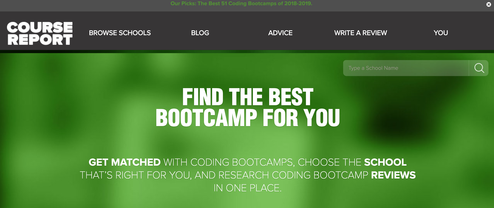
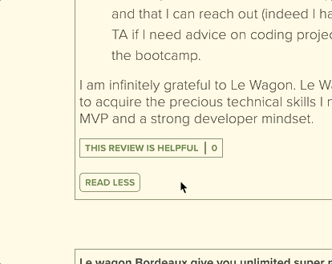
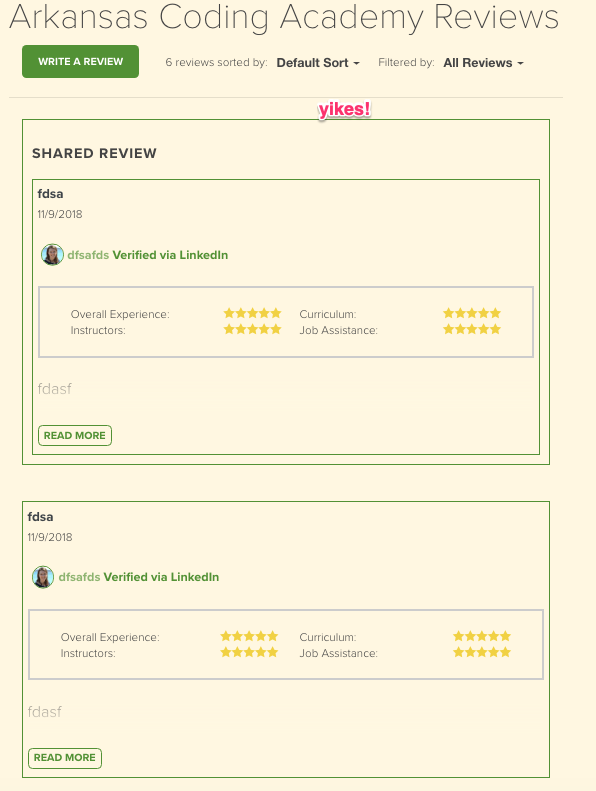

Production site at : https://www.coursereport.com/

# Course Report - Production Site Internship

> Course Report is a site that helps users choose a coding bootcamp to attend.  The site features individual bootcamp information along with ratings and reviews for the site.  During my internship, I was able to work on a number of features that made it to the live production site. However, Course Report did not want me to share any code from my repo, so screenshots below are provided instead.

---

## Features

- Active admin (and some parts of the live site) had some features that used N+1 queries. These were cleaned up to speed up the performance of the site.

- Users can mark a review as helpful. If a user clicks the button again, it will unmark the review.

- If a user leaves a review which is the first review displayed on the page, and then clicks on the link to their review (the Shared Review link) that Course Report includs in the confirmation email; then it looks like their review is published twice. Course Report got a lot of concerned emails about this. The solution presented was to still feature the review that was just published, but filter out the "duplicate" review from the list of reviews shown below.

---
